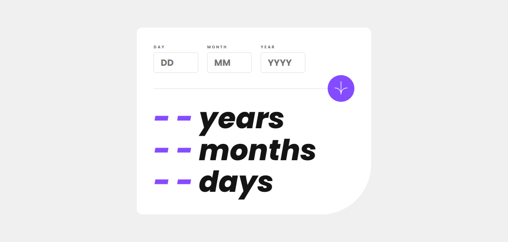
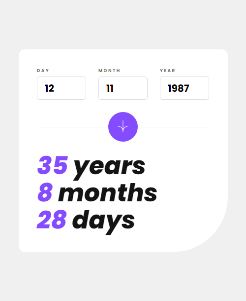
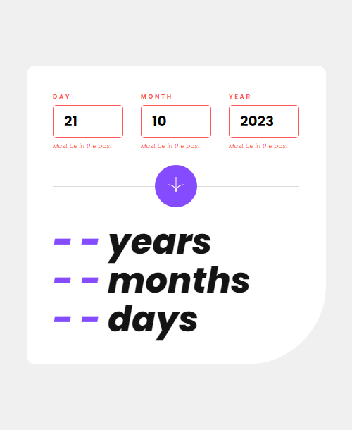
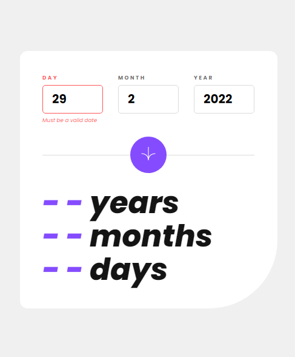
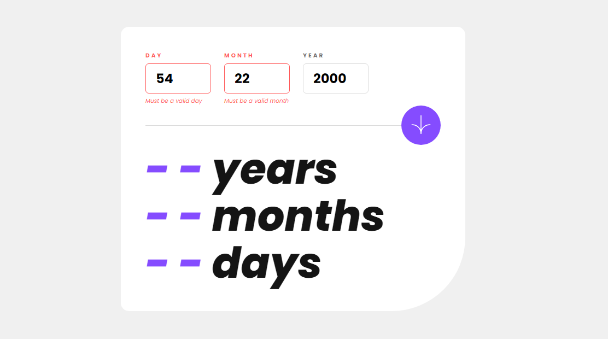

# Frontend Mentor - Age calculator app solution

This is a solution to the [Age calculator app challenge on Frontend Mentor](https://www.frontendmentor.io/challenges/age-calculator-app-dF9DFFpj-Q). Frontend Mentor challenges help you improve your coding skills by building realistic projects. 

## Table of contents

- [Overview](#overview)
  - [The challenge](#the-challenge)
  - [Screenshot](#screenshot)
  - [Links](#links)
- [My process](#my-process)
  - [Built with](#built-with)
  - [What I learned](#what-i-learned)
- [Author](#author)
- [Acknowledgments](#acknowledgments)

## Overview

### The challenge

Users should be able to:

- View an age in years, months, and days after submitting a valid date through the form
- Receive validation errors if:
  - Any field is empty when the form is submitted
  - The day number is not between 1-31
  - The month number is not between 1-12
  - The year is in the future
  - The date is invalid e.g. 31/04/1991 (there are 30 days in April)
- View the optimal layout for the interface depending on their device's screen size
- See hover and focus states for all interactive elements on the page

### Screenshot

 





### Links

- Solution URL: https://www.frontendmentor.io/solutions/bright-and-adaptive-application-for-you-MlX_3-ibWs
- Live Site URL: https://anarenaa.github.io/age-calculator-app/

## My process

### Built with

- BEM
- CSS custom properties
- HSL
- Flexbox
- REM
- Without any frameworks

### What I learned

Thanks to this challenge, I learned:
- how to work with Date in js
- how to validate fields
- how to determine the leap year (more difficult than it seems)
- how to avoid inaccuracies when working with months:
```js
function getDateInMonth(y, m) {
  return new Date(y, m, 0).getDate(); // get the last day of the specified month
}
```
- how to work with REM and adapt the site with it

## Author

- Frontend Mentor - [@Anarenaa](https://www.frontendmentor.io/profile/Anarenaa)

## Acknowledgments

Thanks to the GreatStack channel for helping me write the code to calculate the difference between two dates!
